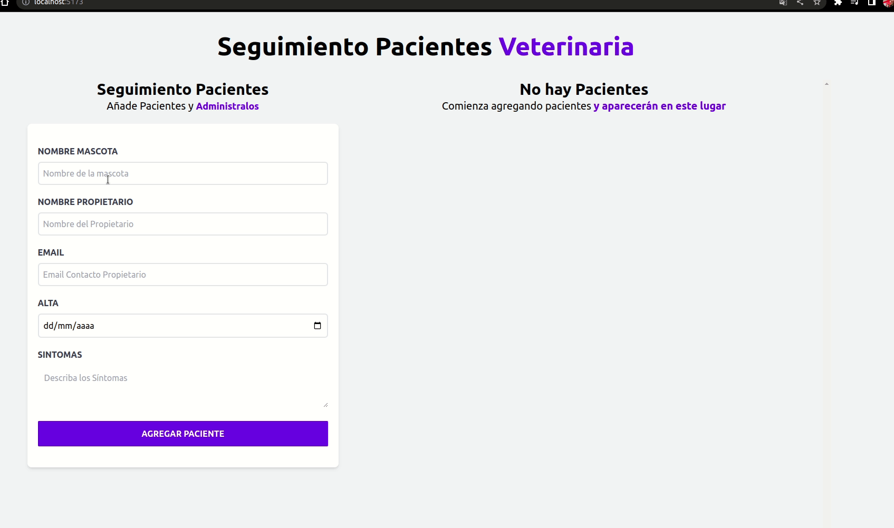

# App para administrar citas para Veterinaria

Proyecto para administrar citas y realizar seguimiento para un establecimiento Veterinaria. Se Utilizar React, Vite, TailwindCss y hooks brindados por la libreria React.
La aplicación permite cargar una cita detallando nombre de mascota, propietario, fecha y sintomas. Al agregarlo queda almacenado en memoria, teniendo el respaldo de almacenamiento en localStorage para no perder los datos al actualizar. Las citas pueden modificarse o eliminarse. Posee validacion de campos de formulario. No se utilizó redux por la sencillez del proyecto.

[Acceso a App](https://citas-veterinaria-kappa.vercel.app/)

## Video Demo

## Ejecutando este Proyecto

1. Abre la terminal de Git
2. Cambia el directorio de trabajo actual a la ubicación en donde quieres clonar el directorio.
   `cd proyecto`

3. Escribe git clone seguido de la [URL](https://github.com/emanuelheredia/Citas-veterinaria) del proyecto

`git clone https://github.com/emanuelheredia/Citas-veterinaria `

4. Presiona Enter para crear tu clon local

    > $ git clone https://github.com/YOUR-USERNAME/YOUR-REPOSITORY
    > Cloning into `Spoon-Knife`...
    > remote: Counting objects: 10, done.
    > remote: Compressing objects: 100% (8/8), done.
    > remove: Total 10 (delta 1), reused 10 (delta 1)
    > Unpacking objects: 100% (10/10), done.

5. Instalar todas las dependencias necesarias dentro del directorio del proyecto
   `npm install`

6. Por último inicia el proyecto con npm start donde se iniciará el dashboard de expo en el navegador
   `npm run dev`

# Mis Redes :

-   [GITHUB](https://github.com/emanuelheredia)
-   [LINKEDIN](https://www.linkedin.com/in/emanuel-heredia-41749421a/)
